# Projeto com Raspberry Pi Pico W - BitDogLab - EmbarcaTech

Este repositório contém o código e a documentação do projeto final do programa EmbarcaTech, desenvolvido com o **Raspberry Pi Pico W**, utilizando o kit da **BitDogLab**. O projeto consiste na criação do **AquaAlert**, um sistema inteligente projetado para aquaristas que desejam monitorar e gerenciar remotamente o ambiente de seus aquários. 

Atualmente, o **AquaAlert** está em sua versão inicial e já é capaz de identificar quedas de energia em equipamentos do aquário. Quando uma queda é detectada, o sistema emite alertas sonoros e visuais localmente, além de enviar essas informações para a web através de um servidor interno que hospeda um site HTML simples. Essa funcionalidade é o primeiro passo para um sistema mais abrangente, que no futuro poderá monitorar outros parâmetros críticos, como temperatura, pH, nível de água e muito mais.

O projeto está em constante desenvolvimento, e a ideia é expandir suas funcionalidades à medida que novos recursos e investimentos forem disponibilizados. O **AquaAlert** representa um primeiro passo na criação de soluções embarcadas que unem tecnologia e **cuidados com aquários**, e estou animados com o potencial que ele tem para evoluir e se tornar uma ferramenta essencial para aquaristas.

## 📋 Tabela de Conteúdos

- [🌐 Visão Geral](#-visao-geral)
- [💻 Hardware](#-hardware)
- [🛠️ Software](#-software)
- [🔧 Montagem Física](#-montagem-fisica)
- [🚀 Como Usar](#-como-usar)
- [🤝 Contribuição e Considerações Finais](#-contribuicao-e-consideracoes-finais)

# 🌐 Visão Geral

Este projeto utiliza o Raspberry Pi Pico W, um microcontrolador baseado no chip RP2040, combinado no kit BitDogLab para prototipagem rápida. O AquaAlert monitora quedas de energia em equipamentos críticos do aquário, como filtros e aquecedores. Quando uma anomalia é detectada, o sistema emite alertas sonoros e visuais no local e envia notificações para um site hospedado em um servidor interno.

Desenvolvido em C, o código é otimizado para o RP2040, aproveitando sua eficiência energética e capacidade de multitarefa. No futuro, o sistema poderá evoluir para monitorar outros parâmetros, como temperatura, pH e nível de água, tornando-se uma ferramenta essencial para o cuidado de aquários.

# 🛠️ Hardware

### Componentes Utilizados

- **Raspberry Pi Pico W**: O microcontrolador principal do projeto, baseado no chip **RP2040**, que possui um processador ARM Cortex-M0+ dual-core (até 133 MHz), 264 KB de SRAM e suporte a até 16 MB de memória flash externa. Com conectividade **Wi-Fi integrada**, possui uma GPIO de 40 pinos, sendo que 26 deles são multifuncionais suportam protocolos como I2C, SPI e UART, facilitando a integração com sensores e atuadores.

- **BitDogLab**: Kit de desenvolvimento que inclui o **Raspberry Pi Pico W** e uma variedade de sensores e atuadores para prototipagem. Abaixo estão os componentes do kit que foram utilizados no projeto:
  - **Buzzer A e Buzzer B**: 
    - Emite o alarme sonoro quando uma queda de energia é detectada e emite um bip curto para indicar que um equipamento está ligando.
  - **Botão A e Botão B**: 
    - Permitem ativar ou desativar o alarme manualmente diretamente na placa, além da opção de controle via site.
  - **LED Solo**: 
    - Auxilia no aviso de inicialização (bip) e também pisca durante o alarme, complementando os alertas visuais.
  - **Matriz de LED 5x5**: 
    - Ativada junto com o alarme ou quando o botão do joystick é pressionado, servindo como um teste visual das funcionalidades.
  - **Display OLED**: 
    - Exibe informações do sistema, como status de conexão Wi-Fi, endereço IP e outras mensagens úteis, eliminando a obrigatoriedade de usar o Monitor Serial.
  - **Joystick e Botão do Joystick**: 
    - Joystick: Usado para navegar entre as informações exibidas no display OLED (movimentos laterais e verticais).
    - Botão do Joystick: Ativa a matriz de LED para testes, sem interferir no funcionamento do alarme.
- **Outros Componentes**:
  - Resistores, jumpers e conexões elétricas.

### Componentes do BitDogLab Não Utilizados
- **Microfone**: Disponível no kit, mas não foi utilizado no projeto atual, pois não havia uma aplicação clara para ele no contexto do AquaAlert.

## 🔌 Conexões

Aqui estão as conexões entre os componentes e os pinos GPIO do **Raspberry Pi Pico W**:

- **GP12**: Conectado ao **LED Solo** para indicar o estado de inicialização e participar do alarme visual.
- **GP21**: Conectado ao **Buzzer A** para emitir o alarme sonoro quando uma queda de energia é detectada.
- **GP10**: Conectado ao **Buzzer B** para emitir um bip curto, indicando que um equipamento está ligando.
- **GP7**: Conectado à **Matriz de LED 5x5** para ativar os LEDs durante o alarme ou testes.
- **GP5**: Conectado ao **Botão A** para ligar o alarme manualmente.
- **GP6**: Conectado ao **Botão B** para desligar o alarme manualmente.
- **GP29**: Conectado ao pino **VSYS** para leitura da tensão do sistema e detecção de quedas de energia.
- **GP14 (SDA)**: Conectado ao pino **SDA** do **Display OLED** para comunicação I2C.
- **GP15 (SCL)**: Conectado ao pino **SCL** do **Display OLED** para comunicação I2C.
- **GP26**: Conectado ao **eixo X do Joystick** (via ADC) para leitura dos movimentos horizontais.
- **GP27**: Conectado ao **eixo Y do Joystick** (via ADC) para leitura dos movimentos verticais.
- **GP22**: Conectado ao **Botão do Joystick** para ativar a matriz de LED durante testes.

### Detalhes Adicionais:
- **VSYS (GP29)**: Utilizado para monitorar a tensão do sistema e detectar quedas de energia. O código faz uma média móvel de 10 leituras para garantir precisão.
- **I2C (GP14 e GP15)**: Utilizado para comunicação com o **Display OLED**, exibindo informações como status de conexão Wi-Fi, endereço IP e outros dados.
- **Joystick**:
  - **GP26 (eixo X)**: Mede os movimentos horizontais do joystick, usados para navegar entre as telas do display OLED.
  - **GP27 (eixo Y)**: Mede os movimentos verticais do joystick, usados para navegar entre as telas do display OLED.
  - **GP22 (botão)**: Ativa a matriz de LED para testes quando pressionado.

# 💻 Software

### Funções Principais

O código do **AquaAlert** foi desenvolvido em **C** e está organizado em funções que gerenciam diferentes aspectos do sistema. Abaixo estão as principais funções e suas responsabilidades:

1. **`iniciar_alerta()`**:
   - **Responsabilidade**: Ativa o alarme quando uma queda de energia é detectada ou quando o botão de alarme é pressionado.
   - **Funcionamento**: Emite bipes sonoros e aciona os LEDs (solo e matriz) em um padrão intermitente.
   - **Dependências**: Utiliza as funções `emitir_bipes()`, `npSetLED()`, `npWrite()`, e `parar_alerta()`.

2. **`parar_alerta()`**:
   - **Responsabilidade**: Desativa o alarme, interrompendo os bipes e desligando os LEDs.
   - **Funcionamento**: Desliga os buzzers e LEDs, e atualiza o estado do alarme para `false`.
   - **Dependências**: Utiliza as funções `npClear()`, `npWrite()`, e `pwm_set_enabled()`.

3. **`emitir_bipes()`**:
   - **Responsabilidade**: Emite um padrão de bipes sonoros e aciona os LEDs de forma sincronizada.
   - **Funcionamento**: Liga os buzzers e LEDs por 500 ms, depois os desliga por 200 ms.
   - **Dependências**: Utiliza as funções `npSetLED()`, `npWrite()`, e `pwm_set_enabled()`.

4. **`ler_tensao_vsys()`**:
   - **Responsabilidade**: Lê a tensão do sistema (VSYS) para detectar quedas de energia.
   - **Funcionamento**: Realiza a leitura do ADC no pino VSYS e converte o valor para tensão.
   - **Dependências**: Utiliza a função `adc_read()`.

5. **`joystick_read_axis()`**:
   - **Responsabilidade**: Lê os valores dos eixos X e Y do joystick.
   - **Funcionamento**: Realiza a leitura dos canais ADC correspondentes aos eixos X e Y do joystick.
   - **Dependências**: Utiliza a função `adc_read()`.

6. **`exibir_matriz_led()`**:
   - **Responsabilidade**: Controla a matriz de LEDs 5x5, exibindo um padrão específico (como um peixe).
   - **Funcionamento**: Define as cores de cada LED com base em uma matriz de valores RGB e atualiza a matriz de LEDs.
   - **Dependências**: Utiliza as funções `npSetLED()` e `npWrite()`.

7. **`configurar_pwm()`**:
   - **Responsabilidade**: Configura os pinos dos buzzers para funcionarem com PWM.
   - **Funcionamento**: Define a frequência e o duty cycle do PWM para os buzzers A e B.
   - **Dependências**: Utiliza as funções `pwm_set_wrap()` e `pwm_set_chan_level()`.

8. **`start_http_server()`**:
   - **Responsabilidade**: Inicia um servidor HTTP simples na porta 80 para receber comandos via web.
   - **Funcionamento**: Cria um PCB (Protocol Control Block) e escuta conexões, permitindo ligar/desligar o alarme via requisições HTTP.
   - **Dependências**: Utiliza as funções `tcp_new()`, `tcp_bind()`, e `tcp_listen()`.

9. **`http_callback()`**:
   - **Responsabilidade**: Processa as requisições HTTP recebidas pelo servidor.
   - **Funcionamento**: Verifica se a requisição é para ligar ou desligar o alarme e envia uma resposta HTTP com o status atual.
   - **Dependências**: Utiliza a função `tcp_write()`.

10. **`setup_joystick()`**:
    - **Responsabilidade**: Configura os pinos do joystick e do botão para leitura.
    - **Funcionamento**: Inicializa os pinos do joystick como entradas ADC e o botão como entrada com pull-up.
    - **Dependências**: Utiliza as funções `adc_gpio_init()` e `gpio_pull_up()`.

### Estrutura do Código

O código do **AquaAlert** está organizado da seguinte forma:

#### Arquivos Principais:
1. **`aqua_alert.c`**:
   - Contém a função principal (`main()`), que inicializa os componentes, configura o Wi-Fi, e gerencia o loop principal do programa.

2. **`CMakeLists.txt`**:
   - Arquivo de configuração do CMake, usado para gerenciar a compilação do projeto.
   - Define as bibliotecas, dependências e configurações de compilação.

3. **`lwipopts.h`**:
   - Arquivo de configuração para a biblioteca **lwIP**, que implementa o protocolo TCP/IP.
   - Contém definições específicas para otimizar o uso de recursos no Raspberry Pi Pico W.

4. **`pico_sdk_import.cmake`**:
   - Arquivo de configuração para importar o SDK do Raspberry Pi Pico no projeto.
   - Gerencia as dependências do SDK e as configurações de compilação.

5. **`ws2818b.pio`**:
   - Arquivo de configuração do PIO (Programmable I/O) para controlar a matriz de LEDs WS2818B.
   - Define o programa PIO que será compilado e utilizado para controlar os LEDs.

#### Pasta:
1. **`inc/`**:
   - Contém os arquivos de cabeçalho (`.h`) usados no projeto.
   - **`ssd1306.h`**: Biblioteca para controle do display OLED SSD1306.
   - Outros arquivos de cabeçalho, se houver, também são armazenados aqui.

### Exemplo de Estrutura de Diretórios

Aqui está uma representação visual da estrutura de diretórios do projeto:
```
raspberry_pico_w_aqua_alert_em_c/
├── CMakeLists.txt
├── lwipopts.h
├── pico_sdk_import.cmake
├── ws2818b.pio
├── inc/
│   └── ssd1306.h
└── aqua_alert.c
```

### Todas as Funções 

O código do **AquaAlert** possui várias funções importantes que gerenciam diferentes aspectos do sistema. Abaixo estão todas as funções presentes no código, com suas respectivas responsabilidades:

1. **`http_callback()`**:
   - **Responsabilidade**: Processa as requisições HTTP recebidas pelo servidor.
   - **Funcionamento**: Verifica se a requisição é para ligar ou desligar o alarme e envia uma resposta HTTP com o status atual.
   - **Dependências**: Utiliza a função `tcp_write()`.

2. **`connection_callback()`**:
   - **Responsabilidade**: Associa o callback HTTP à conexão TCP.
   - **Funcionamento**: Configura o callback para processar as requisições recebidas.
   - **Dependências**: Utiliza a função `tcp_recv()`.

3. **`start_http_server()`**:
   - **Responsabilidade**: Inicia um servidor HTTP simples na porta 80.
   - **Funcionamento**: Cria um PCB (Protocol Control Block), liga o servidor na porta 80 e escuta conexões.
   - **Dependências**: Utiliza as funções `tcp_new()`, `tcp_bind()`, e `tcp_listen()`.

4. **`npInit()`**:
   - **Responsabilidade**: Inicializa a máquina PIO para controle da matriz de LEDs.
   - **Funcionamento**: Configura o PIO e a state machine para controlar os LEDs.
   - **Dependências**: Utiliza as funções `pio_add_program()` e `ws2818b_program_init()`.

5. **`npSetLED()`**:
   - **Responsabilidade**: Define a cor de um LED específico na matriz.
   - **Funcionamento**: Atribui valores RGB a um LED no buffer de pixels.
   - **Dependências**: Utiliza a estrutura `npLED_t`.

6. **`npClear()`**:
   - **Responsabilidade**: Limpa o buffer de pixels, desligando todos os LEDs.
   - **Funcionamento**: Define todas as cores dos LEDs como `0`.
   - **Dependências**: Utiliza a função `npSetLED()`.

7. **`npWrite()`**:
   - **Responsabilidade**: Escreve os dados do buffer nos LEDs.
   - **Funcionamento**: Envia os valores RGB para a matriz de LEDs via PIO.
   - **Dependências**: Utiliza a função `pio_sm_put_blocking()`.

8. **`getIndex()`**:
   - **Responsabilidade**: Calcula o índice de um LED na matriz com base nas coordenadas (x, y).
   - **Funcionamento**: Considera a ordem de varredura das linhas (par ou ímpar) para mapear as coordenadas.
   - **Dependências**: Nenhuma.

9. **`exibir_matriz_led()`**:
   - **Responsabilidade**: Exibe um padrão específico (como um peixe) na matriz de LEDs.
   - **Funcionamento**: Define as cores dos LEDs com base em uma matriz de valores RGB e atualiza a matriz.
   - **Dependências**: Utiliza as funções `npSetLED()` e `npWrite()`.

10. **`configurar_pwm()`**:
    - **Responsabilidade**: Configura os pinos dos buzzers para funcionarem com PWM.
    - **Funcionamento**: Define a frequência e o duty cycle do PWM para os buzzers A e B.
    - **Dependências**: Utiliza as funções `pwm_set_wrap()` e `pwm_set_chan_level()`.

11. **`emitir_bipes()`**:
    - **Responsabilidade**: Emite um padrão de bipes sonoros e aciona os LEDs de forma sincronizada.
    - **Funcionamento**: Liga os buzzers e LEDs por 500 ms, depois os desliga por 200 ms.
    - **Dependências**: Utiliza as funções `npSetLED()`, `npWrite()`, e `pwm_set_enabled()`.

12. **`bipes_de_inicializacao()`**:
    - **Responsabilidade**: Emite um bipe longo durante a inicialização do sistema.
    - **Funcionamento**: Liga os buzzers e o LED por 1000 ms, depois os desliga.
    - **Dependências**: Utiliza as funções `gpio_put()` e `pwm_set_enabled()`.

13. **`iniciar_alerta()`**:
    - **Responsabilidade**: Ativa o alarme com bipes contínuos e alertas visuais.
    - **Funcionamento**: Entra em um loop infinito, emitindo bipes até que o alarme seja desativado.
    - **Dependências**: Utiliza as funções `emitir_bipes()` e `parar_alerta()`.

14. **`parar_alerta()`**:
    - **Responsabilidade**: Desativa o alarme, interrompendo os bipes e desligando os LEDs.
    - **Funcionamento**: Desliga os buzzers e LEDs, e atualiza o estado do alarme para `false`.
    - **Dependências**: Utiliza as funções `npClear()`, `npWrite()`, e `pwm_set_enabled()`.

15. **`ler_tensao_vsys()`**:
    - **Responsabilidade**: Lê a tensão do sistema (VSYS) para detectar quedas de energia.
    - **Funcionamento**: Realiza a leitura do ADC no pino VSYS e converte o valor para tensão.
    - **Dependências**: Utiliza a função `adc_read()`.

16. **`setup_joystick()`**:
    - **Responsabilidade**: Configura os pinos do joystick e do botão para leitura.
    - **Funcionamento**: Inicializa os pinos do joystick como entradas ADC e o botão como entrada com pull-up.
    - **Dependências**: Utiliza as funções `adc_gpio_init()` e `gpio_pull_up()`.

17. **`joystick_read_axis()`**:
    - **Responsabilidade**: Lê os valores dos eixos X e Y do joystick.
    - **Funcionamento**: Realiza a leitura dos canais ADC correspondentes aos eixos X e Y do joystick.
    - **Dependências**: Utiliza a função `adc_read()`

###  **Bibliotecas e Dependências**:
   O projeto utiliza as seguintes bibliotecas para gerenciar o hardware e a comunicação:

   - **`pico/stdlib.h`**: Biblioteca padrão do Raspberry Pi Pico, usada para funções básicas como delays e inicialização do sistema.
   - **`hardware/gpio.h`**: Biblioteca para controle dos pinos GPIO.
   - **`hardware/pwm.h`**: Biblioteca para configuração e controle de PWM (Modulação por Largura de Pulso).
   - **`stdio.h`**: Biblioteca padrão de entrada e saída, usada para funções como `printf`.
   - **`hardware/adc.h`**: Biblioteca para leitura de valores analógicos (ADC).
   - **`pico/cyw43_arch.h`**: Biblioteca para gerenciar o chip Wi-Fi CYW43 do Raspberry Pi Pico W.
   - **`lwip/tcp.h`**: Biblioteca para implementação de protocolos TCP/IP, usada no servidor HTTP.
   - **`string.h`**: Biblioteca para manipulação de strings.
   - **`stdlib.h`**: Biblioteca padrão para funções como `malloc` e `free`.
   - **`ctype.h`**: Biblioteca para funções de manipulação de caracteres.
   - **`pico/binary_info.h`**: Biblioteca para adicionar metadados ao binário do projeto.
   - **`inc/ssd1306.h`**: Biblioteca para controle do display OLED SSD1306.
   - **`hardware/i2c.h`**: Biblioteca para comunicação I2C, usada para o display OLED.
   - **`hardware/pio.h`**: Biblioteca para programação do PIO (Programmable I/O), usada para controlar a matriz de LEDs.
   - **`hardware/clocks.h`**: Biblioteca para configuração de clocks do sistema.
   - **`ws2818b.pio.h`**: Biblioteca gerada pelo arquivo `.pio` durante a compilação, usada para controlar a matriz de LEDs WS2818B.


 ### Configurações de Hardware 
   - As definições de pinos e constantes estão no início do código, facilitando a adaptação para outros projetos ou placas.

```c
#define LED_PIN 12        // Pino do LED (GP12)
#define BUZZER_A_PIN 21   // Pino do Buzzer A (GP21)
#define BUZZER_B_PIN 10   // Pino do Buzzer B (GP10)
#define LED_PIN_MATRIZ 7  // Pino da Matriz de LED RGB (GP7)
#define LED_COUNT 25      // Número de LEDs na matriz
#define BUTTON_ALARM_ON 5  // Botão para ligar alarmes (GP5)
#define BUTTON_ALARM_OFF 6 // Botão para desligar alarmes (GP6)
#define VSYS_PIN 29        // Pino para leitura da tensão VSYS (GP29)
const uint I2C_SDA = 14;   // Pino SDA do display OLED (GP14)
const uint I2C_SCL = 15;   // Pino SCL do display OLED (GP15)

// Definições para leitura da tensão VSYS
#define USB_CONNECTED_VOLTAGE 4.0f  // Tensão mínima para considerar USB conectado
#define NUM_AMOSTRAS 10             // Número de leituras para média móvel

// Definições para as faixas de valores do joystick
#define JOYSTICK_MIN 1000  // Valor mínimo para considerar movimento
#define JOYSTICK_MAX 3000  // Valor máximo para considerar movimento

// Definições do Joystick
const int vRx = 26;          // Pino de leitura do eixo X do joystick (conectado ao ADC)
const int vRy = 27;          // Pino de leitura do eixo Y do joystick (conectado ao ADC)
const int ADC_CHANNEL_0 = 0; // Canal ADC para o eixo X do joystick
const int ADC_CHANNEL_1 = 1; // Canal ADC para o eixo Y do joystick
const int SW = 22;           // Pino de leitura do botão do joystick

// Variáveis globais
bool alarme_ativo = false;   // Estado do alarme
bool com_internet = true;    // Estado do Wi-Fi
bool matriz_ligada = false;  // Estado da matriz de LEDs
int tela_atual = 0;          // Tela atual (0 = Status e Tensão, 1 = IP, 2 = Temperatura, 3 = pH)
char ip_address_str[16];     // String para armazenar o endereço IP

// Configurações do Wi-Fi
#define WIFI_SSID "Nome"  // Nome da rede Wi-Fi
#define WIFI_PASS "Senha"    // Senha da rede Wi-Fi
```

# 🔌 Montagem Física

A **BitDogLab** é um kit de desenvolvimento para prototipagem rápida, projetado para facilitar a criação de projetos com o Raspberry Pi Pico W. Ela já vem montada e pronta para uso, sem a necessidade de alterações físicas, e inclui diversos componentes integrados, como display OLED, matriz de LEDs, buzzers, botões e joystick. Abaixo está uma imagem da placa e a disposição dos componentes:

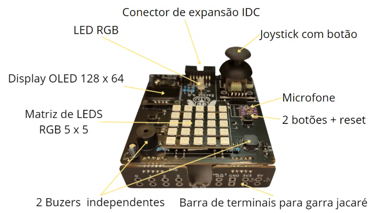 
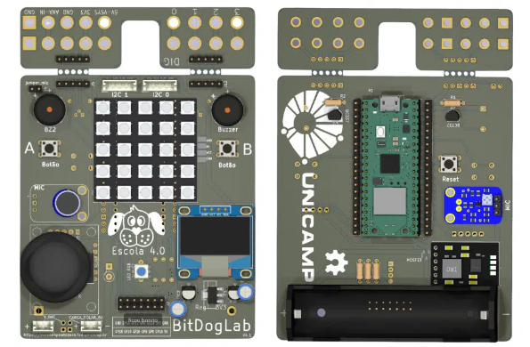

### Componentes da BitDogLab utilizados no projeto:
- **Raspberry Pi Pico W**: Conectado diretamente à BitDogLab.
- **Display OLED**: Conectado via I2C (GP14 e GP15).
- **Matriz de LEDs**: Controlada via PIO (GP7).
- **Buzzer A e Buzzer B**: Conectados aos pinos GP21 e GP10, respectivamente.
- **Botões A e B**: Conectados aos pinos GP5 e GP6.
- **Joystick**: Conectado aos pinos GP26 (eixo X), GP27 (eixo Y) e GP22 (botão).
- **LED Solo**: Conectado ao pino GP12.

### Mais Informações:
Para mais detalhes sobre a **BitDogLab**, consulte o [embarcados.com.br](https://embarcados.com.br/bitdoglab-uma-jornada-educativa-com-eletronica-embarcados-e-ia/)

# 🚀 Como Usar

A intenção principal deste projeto é que, no futuro, o equipamento funcione de forma simples: basta conectá-lo à tomada, realizar uma configuração rápida pelo aplicativo e começar a usar. No entanto, como ainda estamos na fase de prototipagem e para incentivar a comunidade open source, disponibilizo o código para ser utilizado na sua própria **BitDogLab**.

### Pré-requisitos
Para quem nunca utilizou a **BitDogLab** recomendo o tutorial do Professor Jivago : https://www.youtube.com/watch?v=cMtbuvkkF5c&t=106s

1. Ambiente :
    * instale do VS Code
    * instale o Compilador ARM GCC
    * instale o Raspberry Pi Pico SDK (Não esqueça de configurar as variáveis de ambiente)
    * instale os Plugins VS Code (C/C++, CMake, CMake Tools,) 

2. **Clone o repositório**:
   ```bash
   git clone https://github.com/wallaceeBenites/raspberry_pico_w_aqua_alert_em_c.git

2. **Compile e coloque para rodar na BitDogLab**:

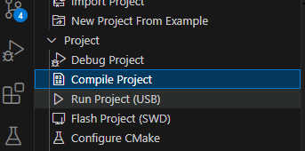

## 🐠🌊 Como utilizar em seu aquário 

O **AquaAlert** foi projetado para ser uma solução simples. Abaixo está um guia passo a passo para configurar e utilizar o equipamento:

---

#### Passo 1: Configuração do Wi-Fi

Futuramente, a ideia é que o usuário do AquaAlert não precise mexer com código para utilizar o equipamento. No entanto, como este é um protótipo, é necessário configurar o nome da rede e a senha da sua casa diretamente no código.

**O que fazer:**

1. Abra o arquivo `aqua_alert.c` no seu editor de código.
2. Localize as linhas que definem o nome da rede Wi-Fi e a senha.
3. Substitua os valores pelos dados da sua rede Wi-Fi.
4. Salve o arquivo e compile o código.


#### Passo 2: Conectar a BitDogLab

Conecte a BitDogLab com a bateria ativada e ligue-a na régua de energia dos equipamentos do seu aquário. Certifique-se de que a conexão esteja firme e segura.


#### Passo 3: Inicialização do Equipamento

Após ligar o equipamento, o seguinte comportamento é esperado:

- No Display OLED, aparecerá a mensagem:
```
INICIANDO EQUIPAMENTO
AGUARDE
```

- Assim que o equipamento inicializar, o LED Solo (na cor azul) acenderá, seguido de um bip de 1 segundo.

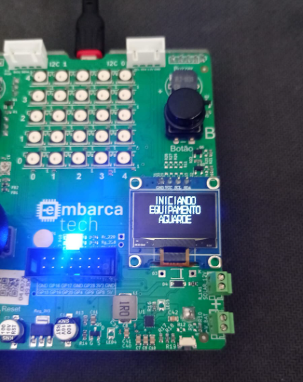

#### Passo 4: Verificação do Status

Após a inicialização, o display exibirá uma das seguintes mensagens:

- **Conexão bem-sucedida:**
```
Tensao VSYS: X.XX V
STATUS OK
```
O valor `X.XX` representa a tensão que o equipamento está recebendo, seja da bateria ou da energia elétrica.

- **Erro de conexão:**
```
Tensao VSYS: X.XX V
WiFi ERRO
```
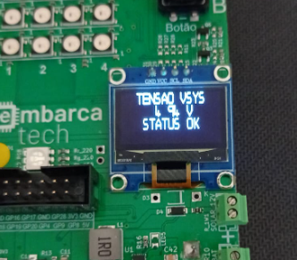
 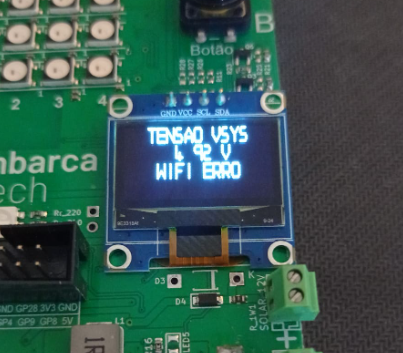

## Passo 5: Navegação no Display

Utilizando o joystick, o usuário pode alternar entre as telas do display. São 4 telas disponíveis:

1. **Tela Padrão:**
 - Exibe o status do sistema (tensão VSYS e status do Wi-Fi).
 - Acessada ao ligar o equipamento.

2. **Tela de IP:**
 - Acessada movendo o joystick para a direita.
 - Exibe o endereço IP do equipamento, que pode ser usado para acessar o site de controle.
 - Caso o Wi-Fi não esteja conectado, aparecerá:

   ```
   No Connection
   ```

3. **Tela de Temperatura:**
 - Acessada movendo o joystick para baixo.
 - Exibe a temperatura da água do aquário (valores fixos temporários).
 - *(Nota: Atualmente, os valores são simulados devido à ausência de um sensor de temperatura. Esta funcionalidade será implementada no futuro.)*

4. **Tela de pH:**
 - Acessada movendo o joystick para cima.
 - Exibe o nível de pH da água (valores fixos temporários).
 - *(Nota: Assim como a temperatura, esta funcionalidade será implementada no futuro.)*

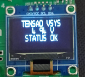
<br>
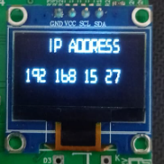
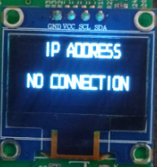
<br>
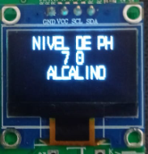
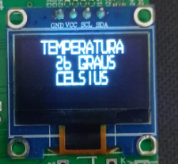

## Passo 6: Funcionamento do Alarme

Caso ocorra uma queda de energia na régua de equipamentos do aquário, o AquaAlert entrará em ação:

- O alarme será ativado, emitindo sons e luzes através do buzzer e dos LEDs.
- No display, o status mudará para:
```
ATENCAO
```
- No site, o status do alarme será atualizado para:
```
Alarme: Ligado
```
**Como desativar o alarme:**

- **Manual:** Pressione o Botão B no equipamento.
- **Site:** Acesse o site do equipamento e clique em "Desligar Alarme".

**Como testar o alarme:**

- **Manual:** Pressione o Botão A no equipamento.
- **Site:** Acesse o site do equipamento e clique em "Ligar Alarme".

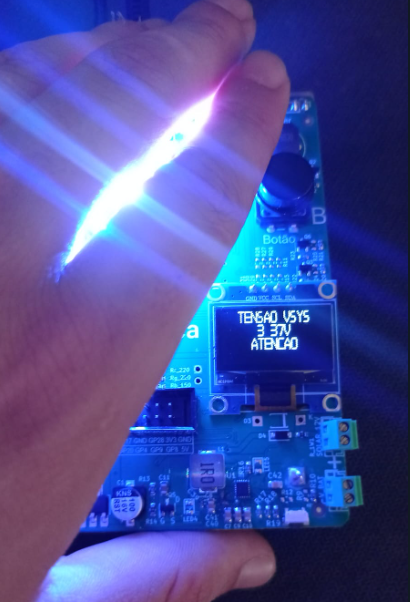

## Passo 7: Acesso ao Site de Controle

O AquaAlert possui um site de controle onde você pode acompanhar o status do alarme e ativá-lo ou desativá-lo remotamente. Para acessar o site, basta usar o endereço IP que aparece na **Tela de IP** do display do equipamento. Digite esse endereço IP no navegador do seu computador ou smartphone conectado à mesma rede Wi-Fi.

**O que você pode fazer no site:**

- Verificar o status do alarme (Ligado/Desligado).
- Ligar ou desligar o alarme manualmente.
- Acompanhar a tensão VSYS e o status do Wi-Fi.

**Limitações atuais:**

- A interface do site é simples e não possui recursos avançados.
- A funcionalidade é restrita ao básico devido à capacidade do hardware utilizado.

**Futuras melhorias:**

No futuro, planejo evoluir o site para oferecer uma experiência mais completa e amigável, com:

- Interface gráfica mais moderna e intuitiva.
- Mais funcionalidades de monitoramento (temperatura, pH, etc.).
- Integração com notificações em tempo real.


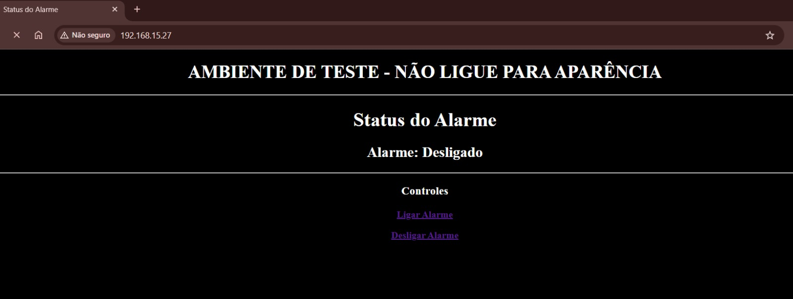

<br>
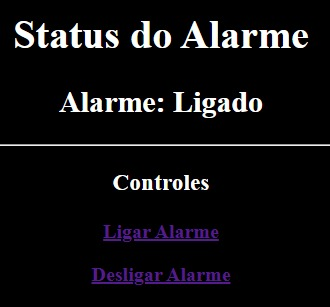
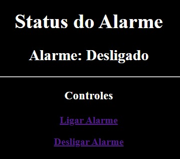


## Passo 8: Observações Finais de Usabilidade

O AquaAlert funciona tanto com Wi-Fi quanto sem Wi-Fi. A única diferença é que, sem Wi-Fi, o site de controle não estará disponível. No entanto, o equipamento continuará funcionando de maneira manual, emitindo alarmes sonoros e visuais diretamente pelo hardware.

Para ver o AquaAlert em funcionamento, confira o vídeo abaixo:
<br>
[](https://www.youtube.com/watch?v=ca81r7wai8M)


# 🤝 Contribuição e Considerações Finais

No futuro, planejamos implementar:

- Sensores de temperatura e pH reais.
- Interface gráfica mais amigável para configuração do Wi-Fi.
- Mais funcionalidades para monitoramento e controle do aquário.

Contribuições são bem-vindas! Sinta-se à vontade para clonar o repositório e modificar o código. Agradeço por ler até aqui! O projeto continuará sendo desenvolvido e atualizado com o tempo, trazendo melhorias e novas funcionalidades. Fique à vontade para acompanhar as atualizações e contribuir com sugestões ou melhorias.

## Referências

- [Tutorial do Professor Jivago](https://www.youtube.com/watch?v=cMtbuvkkF5c): Tutorial inicial para configurar e utilizar a BitDogLab.
- [Documentação do Raspberry Pi Pico](https://www.raspberrypi.com/documentation/microcontrollers/): Documentação oficial do Raspberry Pi Pico W.
- [BitDogLab no Embarcados](https://embarcados.com.br/bitdoglab/): Informações sobre o kit BitDogLab.
- [Raspberry Pi Pico SDK](https://github.com/raspberrypi/pico-sdk): Repositório oficial do SDK do Raspberry Pi Pico.
- [lwIP - Lightweight TCP/IP Stack](https://savannah.nongnu.org/projects/lwip/): Biblioteca usada para implementar o servidor HTTP no projeto.
- [SSD1306 OLED Display Library](https://github.com/adafruit/Adafruit_SSD1306): Biblioteca para controle do display OLED.
 
